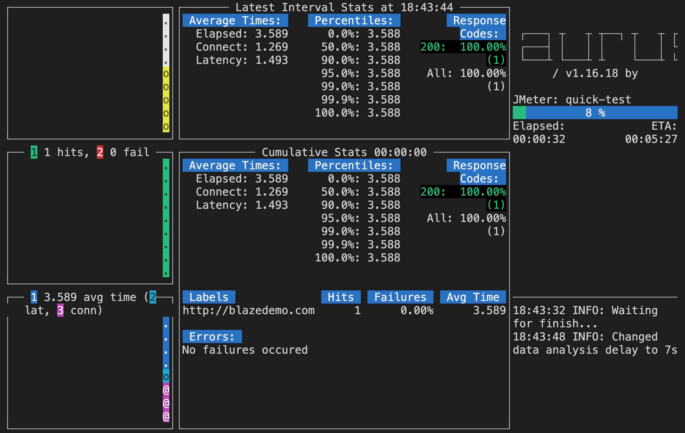

# taurus-tools

Tauros を使用した負荷テストを行うツールです。

## 前提条件

- python3
- Chrome

## 実行環境の準備

1. python の仮想環境を作成し起動する

   ```sh
   $ python3 -m venv venv
   $ source ./venv/bin/activate
   ```

1. 必要な python モジュールをインストールする

   requirements.txt から必要なパッケージをインストール

   ```sh
   $ pip install -r requirements.txt
   ```

1. サンプルテストケースの実行

   初回実行時に必要な依存ライブラリが自動的にローカル環境にインストールされます。(JMeter、Selenium 等)

   ```sh
   $ cd sample-test-case
   $ bzt quick-test.yaml
   ```

   以下のような画面がコンソール上に表示されていれば実行成功

   終了する場合は、`Ctrl + C`

   

## テストの実行

テストの実行には、テストケースを記述したファイルが必要です。

今回は [BlazeMeter の ChromeExtension](https://guide.blazemeter.com/hc/en-us/articles/206732849-Chrome-Extension-Record?utm_source=knowledgebase&utm_medium=kb&utm_campaign=creating-a-jmeter-test) を使用し、画面操作をキャプチャすることでテストケースの yaml ファイルを生成します。

1. Chrome Extension のインストール

   [こちら](https://chrome.google.com/webstore/detail/blazemeter-the-continuous/mbopgmdnpcbohhpnfglgohlbhfongabi)から、ChromeExtension をインストールします。

1. テストケースの記録

   [こちら](https://guide.blazemeter.com/hc/en-us/articles/206732849-Chrome-Extension-Record)の手順を参考に、テストケースのレコードを行います。

1. テストケース定義のダウンロード

   [こちら](https://guide.blazemeter.com/hc/en-us/articles/206732849-Chrome-Extension-Record#download)を参考に、テストケース定義ファイルのダウンロードし、任意のディレクトリに保存します。

   今回はオプションとして、`JMeter & Selenium combined (YAML)`を選択してダウンロードします。

1. テストケース定義ファイルの修正

   selenium での実行が不要な場合は、以下の`executor: seelnium`のセクションをコメントアウトしてください。

   同時実行数は`concurrency`、実行期間は`hold-for`の項目を調整してください。

   ```yaml
   execution:
      # - executor: selenium
      #   scenario: express_sample-Selenium

      #   capabilities:
      #     browserName: chrome
      #   hold-for: 20m

      - executor: jmeter
         scenario: express_sample-Http
         concurrency: 5
         ramp-up: 1m
         hold-for: 60m
   ```

1. テストケース定義の実行

   先ほどダウンロードしたテストケースファイルを以下のコマンドで実行します。

   ```sh
   $ bzt <ダウンロードしたディレクトリ>/<ダウンロードしたファイル名>.yaml
   ```

## 補足

- 仮想環境を停止する

  使い終わったら、仮想環境を以下のコマンドで停止してください。

  ```sh
  $ deactivate
  ```

## 参考

- venv について
  https://qiita.com/fiftystorm36/items/b2fd47cf32c7694adc2e

- Tauros のインストール
  https://gettaurus.org/docs/Installation/

- テストケースのレコード方法
  https://guide.blazemeter.com/hc/en-us/articles/206732849-Chrome-Extension-Record?utm_source=knowledgebase&utm_medium=kb&utm_campaign=creating-a-jmeter-test

- jmeter executor の設定値
  https://gettaurus.org/docs/ExecutionSettings/#Load-Profile
# taurus-tools
